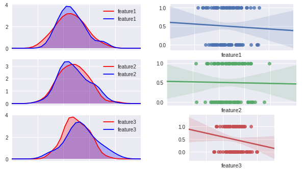
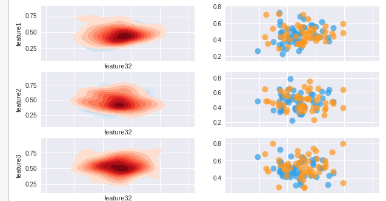

## Distribution of Features for Classification Task

View distribution of each of the features as a kernel density estimation plot, split by the class.



```py
n_features = len(features)
f, axes = plt.subplots(n_features, 2, figsize=(10, 100), sharex=True, sharey=False)
#axes = np.array(axes).flatten() # Unroll axes to a flat list
for row in range(len(axes)):
    # LEFT SIDE
    ax = axes[row][0]
    ax = sns.kdeplot(df.iloc[ones,row], shade=True, color="r", ax=ax)
    ax = sns.kdeplot(df.iloc[np.invert(ones),row], shade=True, color="b", ax=ax)
    ax.set_xlim([0, 1])

    # RIGHT SIDE
    ax = axes[row][1]
    ax = sns.regplot(x=df.iloc[:,row], y=np.array(df["target"]), ax=ax)
    ax.set_aspect(0.3, "box-forced")
```


## Compare Relationship of One var against all other variables
Useful for when there is too many features to be able to create a grid that compares the relationship between all pairs.

**TODO** Add corelation plot and maybe covariance score between the variables.



```
# SCATTER AND BINOMIAL DISTRIBUTION DENSITY PLOTS FOR A CHOSEN FEATURE COMPARED
# TO ALL OTHER FEATURES.
feature_a = 31
n_features = len(features)
f, axes = plt.subplots(n_features, 2, figsize=(10, 100), sharex=True, sharey=False)
for row in range(len(axes)):
    if row == feature_a:
        continue
    # LEFT SIDE
    ax = axes[row][0]
    ax = sns.kdeplot(df[features[feature_a]].iloc[ones], df[features[row]].iloc[ones], cmap="Blues", shade=True, shade_lowest=False, ax=ax)
    ax = sns.kdeplot(df[features[feature_a]].iloc[np.invert(ones)], df[features[row]].iloc[np.invert(ones)], cmap="Reds", shade=True, shade_lowest=False, ax=ax)

    # RIGHT SIDE
    ax = axes[row][1]
    ax.scatter(df[features[feature_a]].iloc[ones], df[features[row]].iloc[ones], c="#319fe5", s=100, alpha=0.7, linewidths=0)
    ax.scatter(df[features[feature_a]].iloc[np.invert(ones)], df[features[row]].iloc[np.invert(ones)], c="#ff971d", s=100, alpha=0.7, linewidths=0)
    # ax.set_aspect(0.3, "box-forced")
```
